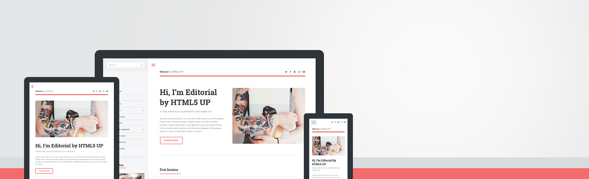

# Editorial - Jekyll Theme

A Jekyll version of the "Editorial" theme by [HTML5 UP](https://html5up.net/).



# How to Use

For those unfamiliar with how Jekyll works, check out [https://jekyllrb.com/](https://jekyllrb.com/) for all the details,
or read up on just the basics of [front matter](https://jekyllrb.com/docs/frontmatter/), [writing posts](https://jekyllrb.com/docs/posts/),
and [creating pages](https://jekyllrb.com/docs/pages/).

# Credits

Original README from HTML5 UP:

```
Editorial by HTML5 UP
html5up.net | @ajlkn
Free for personal and commercial use under the CCA 3.0 license (html5up.net/license)


Say hello to Editorial, a blog/magazine-ish template built around a toggleable "locking"
sidebar (scroll down to see what I mean) and an accordion-style menu. Not the usual landing
page/portfolio affair you'd expect to see at HTML5 UP, but I figured for my 41st (!!!)
template I'd change it up a little. Enjoy :)

Demo images* courtesy of Unsplash, a radtastic collection of CC0 (public domain) images
you can use for pretty much whatever.

(* = not included)

AJ
aj@lkn.io | @ajlkn


Credits:

	Demo Images:
		Unsplash (unsplash.com)

	Icons:
		Font Awesome (fortawesome.github.com/Font-Awesome)

	Other:
		jQuery (jquery.com)
		html5shiv.js (@afarkas @jdalton @jon_neal @rem)
		Misc. Sass functions (@HugoGiraudel)
		Respond.js (j.mp/respondjs)
		Skel (skel.io)
```

Repository [Jekyll logo](https://github.com/jekyll/brand) icon licensed under a [Creative Commons Attribution 4.0 International License](http://choosealicense.com/licenses/cc-by-4.0/).
