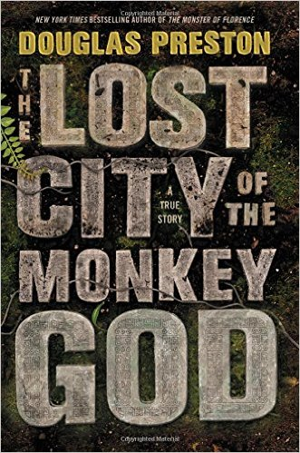
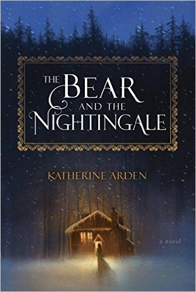
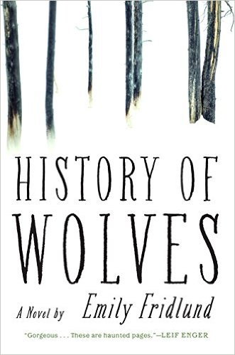
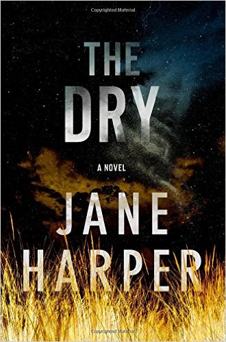
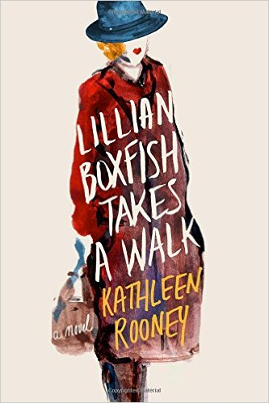
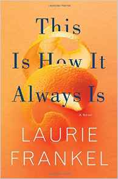

<!-- Section -->
<section>
	<header class="major">
		<h2>Recommendations</h2>
	</header>
	

		<article>
			
			<h3>The Lost City of the Monkey GOd: A True Story</h3>
			
In 2012, author Douglas Preston joined a team of explorers searching for Ciudad Blanca (“The White City”), a legendary ruin hidden in the dense jungle of eastern Hondur...

			<ul class="actions">
				<li><a href="#" class="button">More</a></li>
			</ul>
		</article>
		<article>
			
			<h3>The Bear and the Nightingale: A Novel</h3>
			
There's a small but mighty space where fantasy and literary fiction can clasp hands and create a brilliant story that resonates in the soul. The Bear and the Nightingale...

			<ul class="actions">
				<li><a href="#" class="button">More</a></li>
			</ul>
		</article>
		<article>
			
			<h3>History of Wolves: A Novel</h3>
			
History of Wolves by Emily Fridlund is exactly the kind of book you want to curl up with in the winter. It’s propulsive, vividly written, laced with a razor’s chill...

			<ul class="actions">
				<li><a href="#" class="button">More</a></li>
			</ul>
		</article>
		<article>
			
			<h3>Lillian Boxfish Takes a Walk: A Novel</h3>
			
This is a novel about an 85 year-old woman who wends her way to a party. I may have lost you already, but Kathleen Rooney and her delightful Lillian Boxfish Takes a Walk will... 

			<ul class="actions">
				<li><a href="#" class="button">More</a></li>
			</ul>
		</article>
		<article>
			
			<h3>The Dry: A Novel</h3>
			
I was surprised to realize that The Dry was Jane Harper's debut novel. The writing is fantastic, and the plot - where many mystery/thrillers fall short these days - was completely...

			<ul class="actions">
				<li><a href="#" class="button">More</a></li>
			</ul>
		</article>
		<article>
			
			<h3>This Is How It Always Is</h3>
			
In recent years we’ve seen an increasing number of memoirs from transgender individuals and from parents forging uncharted waters in order to help their...

			<ul class="actions">
				<li><a href="#" class="button">More</a></li>
			</ul>
		</article>
	

</section>
